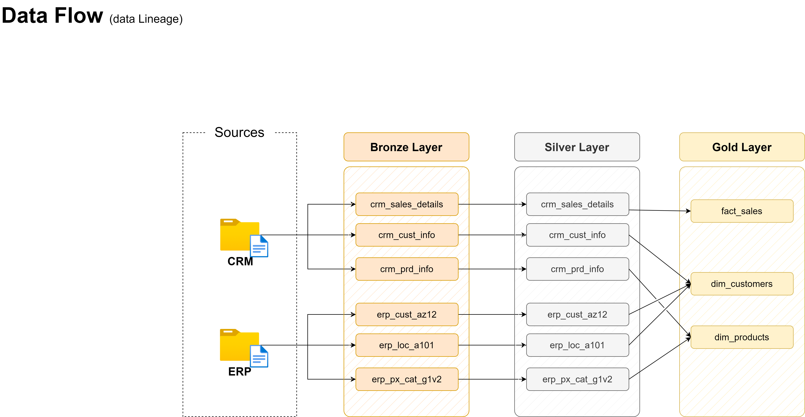

# Data Warehouse and Analytics Project

Welcome to the **Data Warehouse and Analytics Project** repository! 🚀

This project demonstrates a comprehensive data warehousing and analytics solution, from building a data warehouse to generating actionable insights. Designed as a portfolio project, it highlights industry best practices in data engineering and analytics.

---

## 🚀 Project Requirements

### Building the Data Warehouse (Data Engineering)

#### Objective

Develop a modern data warehouse using SQL Server to consolidate sales data, enabling analytical reporting and informed decision-making.

#### Specifications

- **Data Sources**: Import data from the source systems (ERP and CRM) provided as CSV files.
- **Data Quality**: Clean and resolve data quality issues prior to analysis.
- **Integration**: Combine both sources into a single, user-friendly data model designed for analytical queries.
- **Scope**: Focus on the latest dataset only; historization of data is not required.
- **Documentation**: Provide clear documentation of the data model to support both business stakeholders and analytics teams.

---

## Data Architecture


The project follows the Medallion Architecture with three layers:

- **Bronze Layer:** Stores raw data from the source systems (CRM and ERP).
- **Silver Layer:** Cleans, standardizes, and transforms the raw data.
- **Gold Layer:** Provides business-ready data modeled as a star schema for analytics and reporting.

## Data Flow



Data is extracted from CRM and ERP source files and processed through the
Bronze, Silver, and Gold layers.

## Repository Structure

```text
sql-data-warehouse-project/
│
├── datasets/                    # Source CRM and ERP CSV files
│
├── docs/                        # Project documentation and diagrams
│
├── scripts/                     # SQL scripts for ETL and transformations
│   ├── bronze/                  # Raw data loading
│   ├── silver/                  # Data cleaning and transformation
│   └── gold/                    # Dimension and fact views
│
├── tests/                       # Data quality checks
├── init_database.sql            # Database initialization
├── LICENSE                      # MIT License
└── README.md                    # Project documentation
```

## Data Model


The Gold layer follows a star schema consisting of:

- `gold.fact_sales`
- `gold.dim_customers`
- `gold.dim_products`

### BI: Analytics & Reporting (Data Analytics)

#### Objective

Develop SQL-based analytics to deliver detailed insights into:

- **Customer Behavior**
- **Product Performance**
- **Sales Trends**

These insights empower stakeholders with key business metrics, enabling strategic decision-making.

---

## 🛡️ License

This project is licensed under the [MIT License](LICENSE). You are free to use, modify, and share this project with proper attribution.

---

## 👨‍💻 About Me

Hi! I'm **Aleksandar Radojicic**, with a background in **Biomedical Engineering and Electrical Engineering & Information Technology**.

I am interested in **data, SQL, application management, and IT systems**, with a particular interest in applying technology to real-world business and healthcare environments.

This project is part of my practical development in **SQL, data engineering, data warehousing, and analytics**, where I am building hands-on experience with modern data concepts and best practices.
